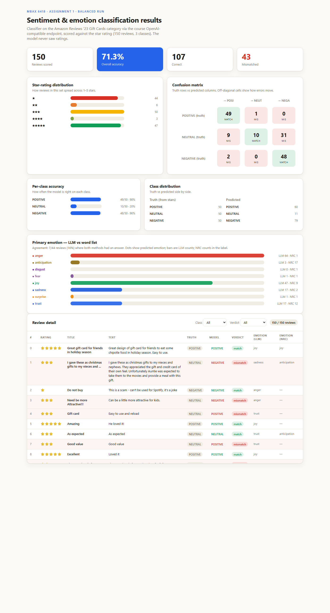

# MBAX 6418 — Assignment 1: Sentiment & Emotion Classification of Amazon Reviews

A working review-sentiment and emotion classifier for the **Amazon Reviews '23**
"Gift Cards" category, driven end-to-end by an agent and written in **Python**.
All model calls go through an **OpenAI-compatible endpoint** (DeepSeek-V4-Flash-0731).

The classifier reads a review's **title + text**, returns a sentiment label and a
primary emotion, and — on the score runs — is checked against the star rating
(the "correct answer"), which it never sees.

---

## Data source

- **Dataset:** Amazon Reviews '23 (2023), **"Gift Cards"** review category.
  Collected by the **McAuley Lab**, UC San Diego.
- **Dataset site:** https://amazon-reviews-2023.github.io
- **Raw review file (gzip JSON Lines):**
  https://mcauleylab.ucsd.edu/public_datasets/data/amazon_2023/raw/review_categories/Gift_Cards.jsonl.gz
- **Emotion lexicon:** NRC Emotion Lexicon (word-level) v0.92 — *Mohammad & Turney (2013)*.
  Word → emotion associations for eight emotions (anger, anticipation, disgust,
  fear, joy, sadness, surprise, trust).

The large review file is re-downloadable and is intentionally **not** committed to
this repository (see `.gitignore`). Download it into `data/` to reproduce:

```bash
curl -L -o data/Gift_Cards.jsonl.gz \
  https://mcauleylab.ucsd.edu/public_datasets/data/amazon_2023/raw/review_categories/Gift_Cards.jsonl.gz
```

---

## What's in here

| File | Role |
|---|---|
| `src/prompt.py` | The reusable, class-set-aware classification prompt |
| `src/classify.py` | Endpoint client + machine-readable answer parsing |
| `src/score_batch.py` | Runs binary (first-100) and balanced 3-class scoring |
| `src/nrc.py` | NRC word-list loader + emotion scoring (no model calls) |
| `src/analyze_emotions.py` | LLM vs word-list primary-emotion comparison |
| `src/dashboard.py` | Offline single-file HTML dashboard generator |
| `src/config.py`, `data.py`, `cli.py` | Config, data reading, CLI spot-check |
| `scripts/make_outputs.py` | Regenerate dashboard + emotion analysis from a run |
| `results/balanced_50_per_class.json` | One balanced run's raw output |
| `results/dashboard.html` | The final dashboard |
| `README.md` | This report |

To reproduce all derived outputs from the saved run:

```bash
python -m pip install -r requirements.txt
python scripts/make_outputs.py
```

(A `.env` with `OPENAI_BASE_URL` / `OPENAI_API_KEY` / `OPENAI_MODEL` points the
scripts at the course endpoint; it is gitignored.)

---

## Step 1 — Binary sentiment classifier (spot-check)

A prompt takes `title` + `text` and returns `POSITIVE` / `NEGATIVE` as a single
JSON object. It never relies on the rating. Every decision is forced by the
prompt to be machine-readable back.

**Hand-written spot-check (all unambiguous cases right):**

| Title | Text (abridged) | Model |
|---|---|---|
| Absolutely loved it | Great gift card, my friend was thrilled… | POSITIVE |
| Terrible experience | The card never activated… | NEGATIVE |
| cashed in | worked exactly as described, no complaints | POSITIVE |
| Waste of money | do not buy | NEGATIVE |

`python -m src.cli spotcheck` re-runs this.

---

## Step 2 — Score against the rating (first 100 rows)

Scored the **first 100 reviews** in file order against the binary rule
(≥4 ★ positive, else negative). **The model never saw the ratings.**

| Metric | Value |
|---|---|
| Reviews scored | 100 |
| **Overall accuracy** | **99.0%** (99/100) |
| Positive class | 93/93 correct — **100%** |
| Negative class | 6/7 correct — **86%** |

**The lopsided-data trap (and why 99% is misleading):** the first 100 rows were
**93 positive vs 7 negative**. A model that mostly says "positive" looks near-perfect
for free. There were too few negatives to trust the 86%. This is exactly why the
balanced sample (Step 6) matters. (An early version of my own per-class summary
miscounted the negative class — caught and fixed by checking the dashboard numbers
against the saved rows, per the assignment.)

---

## Step 6 — Balanced three-class scoring

Redefined sentiment to the full split and re-ran with a **balanced sample**
(~50 rows per class, drawn from the whole file with a fixed random seed 6418,
so the same set comes up every time). The prompt was **carried through to three
classes**, so the model was actually allowed to answer NEUTRAL.

The rating → class rule became: **4–5 ★ = POSITIVE, 3 ★ = NEUTRAL, 1–2 ★ = NEGATIVE**.

| Class | Correct | Accuracy |
|---|---|---|
| POSITIVE | 49/50 | **98%** |
| NEUTRAL | 10/50 | **20%** |
| NEGATIVE | 48/50 | **96%** |
| **Overall** | **107/150** | **71.3%** |

**What the balanced run revealed:** the imbalanced first-100 run looked superb
(99%) only because 93% of it was positive. Once every class is tested equally,
real accuracy drops to 71% — not because positives/negatives got worse (both
~96–98%) but because the model is **weak on the middle class**.

### Do ★★★ reviews get their own class, or collapse?

Confusion matrix (truth rows → predicted columns):

| truth \ predicted | POSITIVE | NEUTRAL | NEGATIVE |
|---|---|---|---|
| **POSITIVE** (50) | 49 | 1 | 0 |
| **NEUTRAL** (50) | 9 | 10 | 31 |
| **NEGATIVE** (50) | 2 | 0 | 48 |

**They mostly collapse.** Even though the prompt permits NEUTRAL, the model
predicts *very few* neutrals overall — of the 50 ★3 reviews, only **10 (20%)**
got their own class. The other 40 split **31 → NEGATIVE (62%)** and **9 →
POSITIVE (18%)**. The model hands out NEUTRAL only 11 times total (7% of
predictions), while predicting NEGATIVE 79× and POSITIVE 60×. So ★3 reviews
are, on average, pulled **toward negative** — the model reads "neutral / lukewarm"
text as dissatisfaction. Error direction: **NEUTRAL→NEGATIVE is by far the
largest single failure cell (31).**

## Step 5 — Primary emotion: LLM vs word list

Two independent emotion detectors ran over the same balanced set:

1. **LLM** — extended the prompt so each review returns a primary emotion from
   the eight NRC emotions.
2. **NRC word list** — scored each review's words against the NRC Emotion
   Lexicon (v0.92), summed per emotion, took the highest.

**Coverage differs sharply:** the LLM assigned an emotion to **150/150** reviews;
the NRC list found a dominant emotion for only **44/150 (29%)** — short or tersely
-worded gift-card reviews often have too few matching lexicon words (or a tie).

**Where both had an answer (44 reviews), they agreed on only 7 — 16%.**

| emotion | LLM | NRC |
|---|---|---|
| anger | 64 | 1 |
| joy | 47 | 9 |
| sadness | 17 | 2 |
| trust | 17 | 12 |
| anticipation | 3 | 17 |
| surprise | 1 | 1 |
| fear | 1 | 1 |
| disgust | 0 | 1 |

**Why they diverge:**
- **The NRC list is a bag of word counters, blind to context.** It can't handle
  negation or sarcasm. A review that *forbids* the product — *"Don't buy this
  card…"* — still gets its words "buy"/"purchase" counted as **trust** by the
  lexicon, while the LLM reads the actual tone as **anger**.
- **Different vocabulary loads.** Gift-card reviews lean on transactional words
  (*buy, purchase, receive, gift, easy*) that the NRC links to **trust** and
  **anticipation**, so the word-list method over-reports those; the LLM attaches
  emotions to the *felt* experience (anger at a failed card, joy at a gift), so it
  over-reports **anger** and **joy**.
- **Coverage.** The word list simply can't score a one-word review ("Ok", "Good");
  the LLM always can.

So the two methods answer **different questions**: the LLM predicts the emotion a
*reader* feels; the NRC list predicts the emotional *vocabulary load* of the text.
Concrete divergences (from the saved output): "Don't buy this card" → LLM **anger**,
NRC **trust**; "Auto-Renewal caused a big problem" → LLM **anger**, NRC **trust**.

---

## Step 7 — Visualizations

The `results/dashboard.html` shows, at a glance: the headline accuracy, a
**star-rating distribution**, a **confusion matrix** (how errors move between
classes), **per-class accuracy**, a **truth-vs-predicted distribution**, the
**LLM vs NRC emotion comparison**, and a **filterable review table** (by class
and by match/mismatch) with a live count. It is a single self-contained HTML
file that works fully offline.

I re-checked the on-page numbers against the saved rows **in the browser** (not
just by eye): every headline figure, confusion cell, and class count on the page
matches `results/balanced_50_per_class.json`.



A non-technical reader should be able to tell at a glance: the model is strong
on the two extreme classes but visibly bad at neutral — the per-class bars and
the confusion matrix make the NEUTRAL→NEGATIVE failure easy to see.

---

## Bugs & issues encountered along the way (report Q4)

1. **Per-class accuracy miscount (my own bug).** An early version of the scorer
   derived negative-correct from `pos_total - pos_correct`, which produced a
   nonsense `0/7` for the negative class. I caught it the way the assignment tells
   you to — by checking the dashboard numbers against the saved rows — and fixed
   the formula, then re-saved the summary.
2. **Dashboard read a stale summary.** After fixing the scorer, the first dashboard
   rebuild still rendered the old wrong negative figure until I recomputed and
   re-saved the summary inside the results JSON. Lesson: the dashboard must read
   derived counts from the *data*, not from a summary baked earlier.
3. **Embedded-webview `<select>` quirk.** The native dropdown in the preview pane
   only fired its `change` event on commit, so arrow-key stepping didn't update
   the live filter count. I wired both `change` and `input` listeners (idempotent),
   so filtering updates on selection in any browser/webview.
4. **Long, opaque scoring runs.** The first batch runs printed nothing until the
   end, making a ~25-minute 150-call run hard to diagnose. I confirmed health by
   checking the Python process was alive and timing a single call (~10 s each) to
   estimate progress; a future improvement is per-row progress output.
5. **Tooling quirks** (background desktop control): capturing the "screen"/own
   window was refused by the automation driver, and a screenshot of the dashboard
   was cleanest produced by headless Chrome (`--headless --screenshot`) rather than
   the desktop capturer.

---

## How to reproduce / run

```bash
# 1. Score a balanced 3-class sample (50 per class, fixed random seed 6418)
python -m src.score_batch --mode balanced --per-class 50

# 2. Regenerate dashboard + emotion analysis from the saved run
python scripts/make_outputs.py

# 3. Open results/dashboard.html
```
